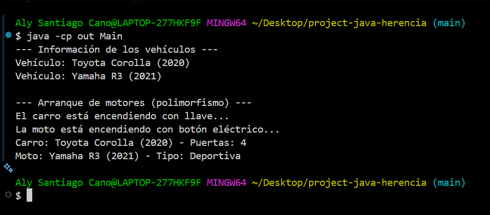

# project-java-herencia

## Descripción
Proyecto de ejemplo para la actividad "Herencia y polimorfismo en Java".  
Contiene una clase base `Vehiculo` y dos clases derivadas `Carro` y `Moto`.  
Se demuestra la sobrescritura de métodos (`encender()`) y el uso de polimorfismo en la clase `Main`.

## Jerarquía de clases
```
Vehiculo
├── Carro
└── Moto
```

## Uso
1. Clase `Vehiculo`:
   - Atributos: `marca`, `modelo`, `año`.
   - Constructor: `Vehiculo(String marca, String modelo, int año)`.
   - Métodos: `encender()`, `info()`.

   ## Archivos principales
- `src/Vehiculo.java`
- `src/Carro.java`
- `src/Moto.java`
- `src/Main.java`

## Captura de consola


## Commits principales realizados
1. feat: creación del repositorio base para proyecto de herencia  
2. feat: agregar clase base Vehiculo  
3. feat: agregar clases hijas Carro y Moto con sobreescritura de métodos  
4. feat: agregar clase Main y prueba de ejecución para demostrar polimorfismo  
5. feat: agregar captura de ejecución en carpeta docs  
6. docs: actualización del README con explicación de jerarquía y captura de ejecución

